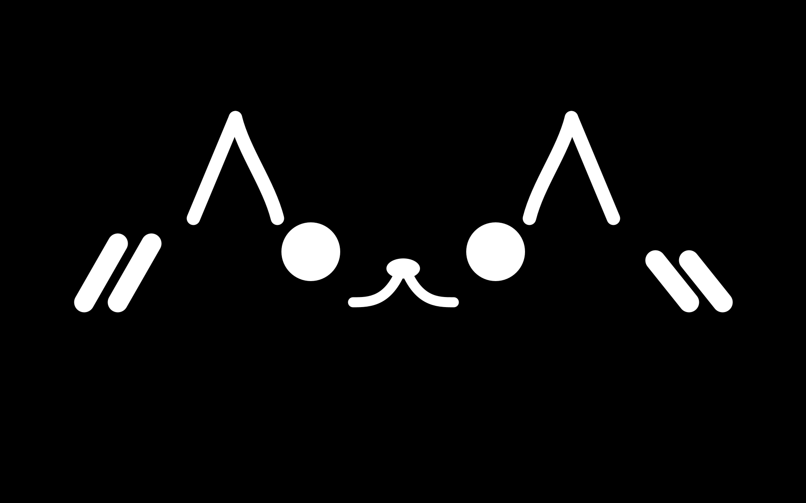

# CAT UI Android App v2.0

This repository contains **CAT UI Android App v2.0**.
Version 2.0 introduces a **TCP + JSON based communication layer** and an **Advanced NLP Voice Engine** that allows external systems (Python, ROS2, etc.) to control cat expressions and on-screen messages in real time with natural Japanese intonation.





このリポジトリは、**Android 上で稼働する猫型キャラクター UI** に外部プロセス（Python / ROS2 / 任意の TCP クライアント）から **JSON 経由で制御情報を送るための通信レイヤー**、および **Kuromoji を用いた自然言語処理（NLP）ベースの音声エンジン** を実装したものです。

表情や描画ロジックの詳細は **別リポジトリに分離**しており、本リポジトリでは **通信、イベント反映、そして高度な発話コントロール** を中心に扱っています。

---

## 📦 関連リポジトリ

* 🐱 表情・描画ロジック: [CAT-UI-processing](https://github.com/Petta-Yukiyanagi/CAT-UI-processing)

この Android アプリでは `CatCharacter` やパーツ描画のロジック自体は上記リポジトリを基にしています。UI 表示の実装やパーツ構成・アニメーションもこちらの設計が元になっています。

---

## 📂 ディレクトリ構成

```text
com.petta.catui
 ├── app/         # アプリの根幹・エントリーポイント
 │    ├── MainActivity.java （Android OSからの起動口）
 │    └── CATUIApp.java     （Processing/UIの総司令塔）
 │
 ├── config/      # 全体設定管理
 │    └── VoiceConfig.java  （assets/voice_config.json のパースと定数保持）
 │
 ├── comm/        # 通信レイヤーとUIスレッド安全機構
 │    ├── SocketReceiver.java    （別スレッドでのTCP受信）
 │    ├── JsonUiEventParser.java （JSON文字列のオブジェクト化）
 │    └── UiEventController.java （イベント解析とUIキューへの追加）
 │
 ├── nlp/         # 自然言語処理・ピッチ計算 (Kuromoji UniDic)
 │    ├── IntonationAnalyzer.java （形態素解析とパーツ分割・SILENCE制御）
 │    └── PitchCalculator.java    （アクセント型に基づくピッチ高低の算出）
 │
 ├── voice/       # 音声再生制御
 │    ├── AnimalVoicePlayer.java （SoundPoolによる複数音源の並列再生）
 │    ├── VoicePartAssets.java   （テキストの音声パーツ分解ロジック）
 │    ├── VoiceController.java   （NLP層とプレイヤーの橋渡し）
 │    └── VoiceType.java         （音声ディレクトリの動的参照）
 │
 ├── expression/  # 表情データの定義と状態管理
 │    ├── ExpressionState.java
 │    └── ExpressionBuilder.java...
 │
 └── graphics/    # 実際の描画・レンダリング処理
      ├── CatCharacter.java
      ├── parts/        （目、口などの個別パーツ）
      └── decorators/   （ハテナマークなどの装飾）
```

---

## 🎯 このリポジトリの目的

* **外部システムからのリアルタイム UI 操作**
* ROS2 などのロボット制御系ノードと連携した表情制御
* Android 端末単独で動作可能（オフライン対応）
* WebSocket を使わず **単純 TCP + JSON で低レイヤーメッセージング**
* **Kuromoji 形態素解析による、日本語の自然なピッチ（イントネーション）表現**

---

## 🔌 通信方式 (TCP プロトコル)

* **TCP Socket**
* ポート: **9000**
* 1 接続 = 1 JSON メッセージ（改行 `\n` 終端）
* 軽量で安定したシンプルなプロトコル（※WebSocket ではありません）

---

## 📡 受信 JSON フォーマット

アプリが受信・反映する JSON は次のような形式です：

```json
{
  "face": 3,
  "text": "こんにちは！Androidから来たよ",
  "reset_after": 3
}
```

| キー | 型 | 説明 |
|---|---|---|
| `face` | int | 表情 ID |
| `text` | string | 画面に表示し、発話させたい文字列 |
| `reset_after` | float | 指定秒後に表情を NORMAL に戻す（省略可能） |

---

## 🧱 UI スレッド安全設計 (Thread Safety)

Processing for Android では、描画と UI 操作はメインスレッドで実行する必要があり、別スレッド（SocketReceiver など）から直接 UI を操作するとクラッシュします。
そこで本リポジトリでは **キュー（Queue）方式で UI スレッドへ引き渡す設計** を採用しています。

**通信スレッド側:**

```java
uiQueue.add(() -> {
    character.setExpression(...);
    textDisplay.showMessage(...);
});
```

**描画スレッド側 (`draw()` 内):**

```java
while ((task = uiQueue.poll()) != null) {
    task.run();
}
```

これにより、通信処理とUI表示が安全に分離され、画面回転や他スレッド競合によるクラッシュを完全に回避しています。

---

## 🔊 音声・NLP 機能のセットアップ (Voice & NLP)

本アプリは、単に音声を並べて再生するだけでなく、**Kuromoji (UniDic)** を用いて文章を解析し、日本語特有の自然なイントネーション（平板型、疑問形など）をリアルタイムに計算して発話します。

### 1. 音声アセットの配置

`android/app/src/main/assets/voice/` 内に、以下の構成でひらがなに対応するローマ字の音声ファイル（例: `a.mp3`, `ko.mp3`）を配置してください。

```text
assets/
 └── voice/
      └── voice_high_speed3/ (使用する音声ファイル群)
```

> ※未知の文字や記号が送られてきた場合は、自動的に無音（SILENCE）として処理される安全設計です。現状はひらがな読みに対応しています。

### 2. キャラクター音声の設定 (JSON)

ピッチの高さ、喋るスピード、文字間隔などを Java コードをコンパイルし直すことなく、`assets/voice_config.json` から動的に変更できます。

**`voice_config.json` の設定例:**

```json
{
  "highPitch": 0.25,
  "lowPitch": -0.25,
  "questionPitch": 1.80,
  "randomFluctuation": 0.06,
  "baseSpeed": 1.0,
  "charInterval": 0.0,
  "targetVoiceDir": "voice_high_speed3"
}
```

* **喋るペースの調整:** `charInterval` を `0.0` から `0.2` などに増やすことで、声のピッチを変えずに文字間のタメ（無音）を作り、ゆっくり喋らせることができます。
* **眠い時の特殊挙動:** 表情が `SLEEPING` の場合、自動的に文字間に大きな無音が挿入され、「こ…ん…に…ち…は」と間延びした喋り方に変化します。

---

## 🧪 テスト用 Python 送信スクリプト

開発・デバッグ用の簡易スクリプト例です。同一LAN内のPCから実行してください。

```python
import socket
import json

HOST = "192.168.10.109"  # Android端末のIPアドレスに変更してください
PORT = 9000

data = {
    "face": 3,
    "text": "デバッグ送信テストです！",
    "reset_after": 2
}

with socket.socket(socket.AF_INET, socket.SOCK_STREAM) as s:
    s.connect((HOST, PORT))
    # 必ず改行(\n)を末尾につけてエンコードする
    s.sendall((json.dumps(data) + "\n").encode("utf-8"))
```

## 🚀 使い方（簡単導入手順）

1. Android 端末・タブレットに APK をインストールします。
2. Android 端末の「設定」等からネットワークパーミッションが許可されているか確認します。
3. 同一 LAN に PC（や ROS2 環境）を接続します。
4. ポート `9000` 宛に JSON を送信し、表情の変更と音声発話が適切に行われることを確認します。